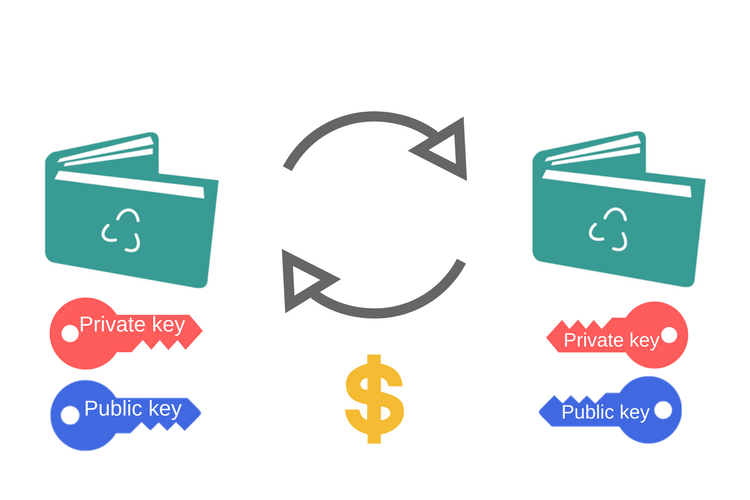

<div style="text-align: center;">

# Create a wallet for digital cryptocurrency

</div>





## Intro:


---

## Project explanation:

In this app user after register to system, by algorithm RSA (asymmetric-key encryption) for target user a public and private key generated. 

Finally, you can send money to us with the public key and open and view it with the private key.

---

## How to run the app:
```
python3 wallet.py
```

---

## Contact:

- Amir mohammad Rezvaninia - [LinkedIn](https://www.linkedin.com/in/amirmohammadrezvaninia/) 


